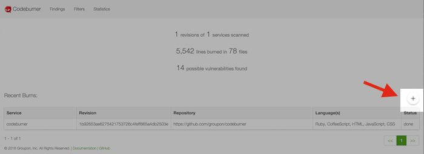

The home page for Codeburner is the 'burns' page.  It can be accessed via the URL <a href="http://localhost:8080/#burn" target="_blank">http://localhost:8080/</a>, or by clicking the 'Codeburner' title/logo in the navigation bar.

To submit a new burn, click on the "Submit Burn" button:



Fill out the form that pops up:


The only required fields are 'Service Name' and 'Repository URL'.  You can optionally specify a specific commit/tag to scan and an e-mail address to notify when the burn is complete.

The list of 'Recent Burns' will refresh automatically, and the status should change to 'done' when it's complete.

If you highlight/click on a specific burn from the list, you'll be taken to the findings page and shown the findings for **just that one burn**:


You can also submit a burn through the REST API (useful for scripting or as part of a CI process):

```bash
curl -X POST -d '{"service_name":"codeburner","repo_url":"https://github.com/groupon/codeburner"}' http://localhost:8080/api/burn
```


***
