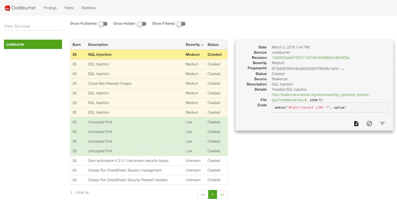
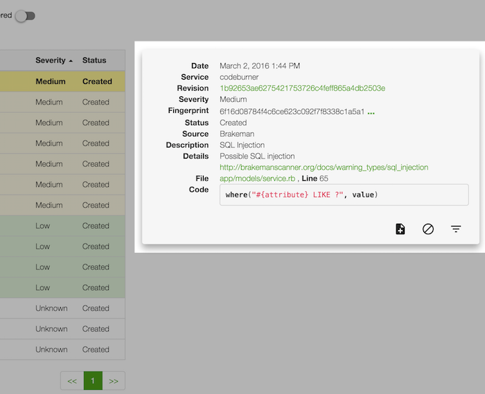
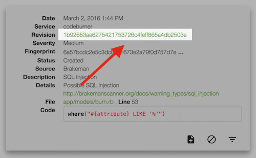
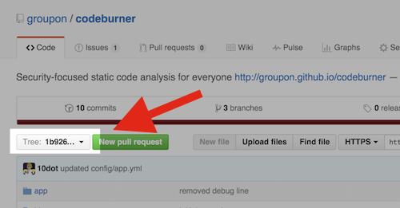
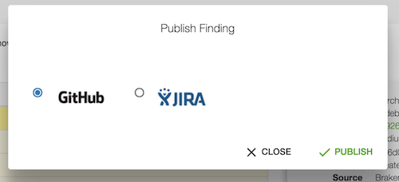
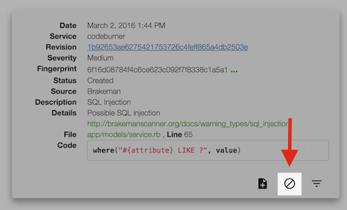
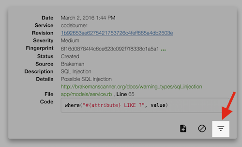

The findings page is the primary interface of Codeburner.  This is where you can see the issues found by the scanning tools, sort/triage them, act on the actionable issues and hide or filter false positives.  You can access the findings page by clicking "Findings" in the nav bar or visiting the URL <a href="http://localhost:8080/#findings" target="_blank">http://localhost:8080/#finding</a>.

***

## Service List
On the left side of the findings page is a list of all the repos you've created by submitting burns.  If you have a long list of repos, you can click the "Filter Services" box at the top and start typing to filter the list of repos.  You can use '*' as a wildcard, and it should honor it anywhere in the query string.

Click a specific repo name to show findings for just that repo.  If you clear the selection (by clicking again) it will switch back to displaying findings for all repos.

***

## Findings List
The middle column of the findings page is the findings list.  By default it shows **open** findings for all repos, or for the repo selected in the repo list on the left.

You can use the toggles at the top to show **hidden/published/filtered** findings (more on that later), and click any of the column headings to sort on that field.  

A repeat click on a column heading changes the sort order.  The default sorting is on severity, descending from high-->unknown.

Click on any finding to show more details on the right...

## Details Pane
The details pane shows extended detail about a selected finding and allows you to act on it.  The quality of the information largely depends on what's provided by the individual scanning tools.  For example, if the tool provides a code snippet it will be shown here with syntax highlighting and a link to view the full context on GitHub.

Clicking the revision link will take you to the root of that commit in GitHub:

If the finding comes from a scanner that reports file and line number, clicking the name of the file will take you to that revision of the file with the relevant line highlighted in GitHub:

### Publish Issues
The first action provided in the details pane is "publish".  The publish action will publish the finding as either a GitHub or JIRA issue.

By default, clicking publish will create a new GitHub issue for you with all the finding details available:

If you select JIRA in the publish dialog, you'll also need to enter the JIRA project to use for creating your issue:

### Hide Issues
If you decide an issue isn't worth publishing and want to simply ignore it, you can use the "hide" action in the details pane.  

Since individual results are uniquely fingerprinted (pipeline calculates a SHA256 by hashing certain finding details concatenated into a single string), hiding here will ensure **that exact finding** isn't reported again.  It also marks the finding as hidden and prevents it from showing up in the default findings list.  

In the case where you want to revisit a hidden issue, you can use the toggle at the top of the findings list to show hidden findings.  If you select a hidden finding, the "hide" button becomes "unhide".

For cases where you want more control over filtering future results like this one, you'll want to use the [Filtering](/user/filters/) interface described below.

### Filtering
Since fingerprints are hashed on a combination of fields, changes to those fields (like line number) result in a different fingerprint.  As such, sometimes "hide" isn't sufficient.  

As an example: let's say you hide a finding on line 120 of a specific file and then refactor.  If the offending line becomes line 125 after your refactor it will be re-reported!  That's where filtering comes in:

The [Filtering](/user/filters/) section covers the use of filters in more detail.

***
