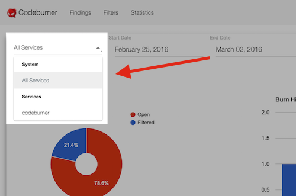
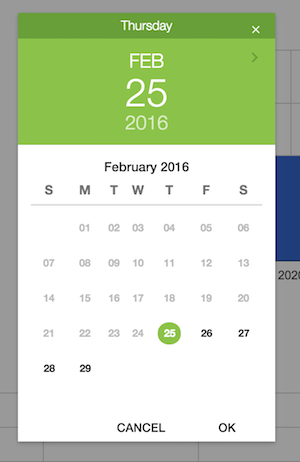
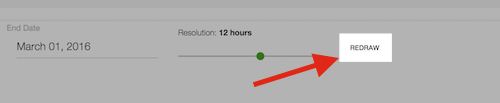

## Google API
The statistics page uses the <a href="https://developers.google.com/chart/" target="_blank">Google Charts API</a> to generate graphs.  If you prefer a different look for your reports, see the API documentation for more details on using the REST API to feed the graphing solution of your choice.

***

## Select a service
On the left you can select a specific service (the default is **All Services**) with substring matching:

If you select a new service, the charts will redraw automatically using default values.

***

## Choose a date range
If you click on either the "Start Date" or "End Date" fields a date picker will appear letting you narrow down the date range of the stats generated:

***

## Tweak history resolution
Codeburner does a fairly good job of choosing a resolution for your statistics based on the length of time between start date and end date to generate nice trend lines.  If you want more control over the graphs produced and want to change the level of detail, you can slide the resolution slider left or right to adjust the resolution:

!!! Warning
    Be careful with the resolution setting.  If you set this too low (say, every 5 minutes on multiple months of history) you can generate a **very** large number of database queries and cause considerable slowdown.

***

## Redraw
After setting a new combination of start date, end date, and resolution you need to click the newly-revealed "Redraw" button to redraw the charts:

